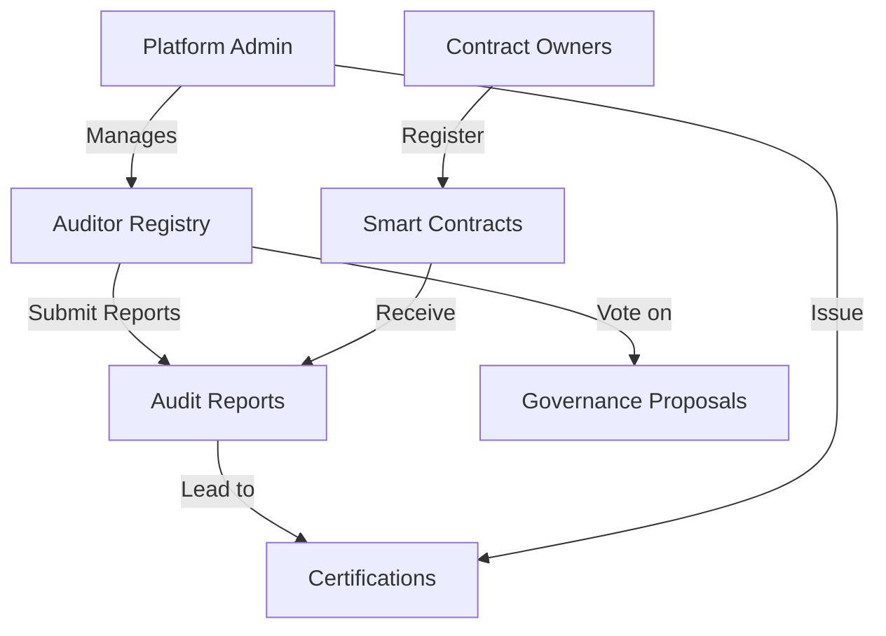

# Chain Compliance Auditor

A decentralized tool for automated and manual auditing of Clarity smart contracts, providing standardized compliance reports and security tracking across contract versions.

## Overview

Chain Compliance Auditor enables secure and transparent smart contract auditing on the Stacks blockchain by:

- Allowing qualified auditors to register and submit formal contract evaluations
- Managing contract certifications and security ratings
- Tracking contract versions and their audit status
- Providing a reputation system for auditors
- Enabling governance through auditor voting
- Making all audit reports and certifications publicly verifiable on-chain

## Architecture

The system is built around a central registry contract that manages the relationships between auditors, contracts, and their audit reports.



### Core Components

1. **Auditor Registry** - Tracks qualified auditors and their reputation
2. **Contract Registry** - Stores contract information and audit status
3. **Audit Reports** - Contains detailed security evaluations
4. **Certifications** - Represents successful audit completions
5. **Governance System** - Enables system upgrades through auditor voting

## Contract Documentation

### chain-audit.clar

The main contract managing the entire auditing system.

#### Key Features

- Auditor registration and management
- Contract registration and versioning
- Detailed audit report submission
- Certification issuance
- Reputation tracking
- Governance voting

#### Access Control

- Platform Admin: Can manage auditors and issue certifications
- Auditors: Can submit reports and vote on proposals
- Contract Owners: Can register and update their contracts
- Public: Can view all audit reports and certifications

## Getting Started

### Prerequisites

- Clarinet
- Stacks wallet
- Access to the Stacks blockchain

### Basic Usage

1. **Register as an Auditor**
```clarity
(contract-call? .chain-audit register-auditor "Auditor Name" "Professional Credentials")
```

2. **Register a Contract**
```clarity
(contract-call? .chain-audit register-contract 
    "contract-id" 
    contract-principal 
    "description" 
    source-code-hash 
    "1.0.0"
)
```

3. **Submit an Audit**
```clarity
(contract-call? .chain-audit submit-audit 
    "contract-id" 
    "1.0.0" 
    u8 
    u7 
    u8 
    "Security findings..." 
    "Recommendations..."
)
```

## Function Reference

### Administrative Functions

- `set-platform-admin(new-admin)`: Transfer admin rights
- `update-auditor-status(auditor, active)`: Activate/deactivate auditors
- `issue-certification(contract-id, version, level, expiration)`: Certify contracts

### Auditor Functions

- `register-auditor(name, credentials)`: Register as an auditor
- `submit-audit(contract-id, version, scores, findings, recommendations)`: Submit audit report
- `rate-auditor(auditor, increase)`: Rate other auditors
- `vote-on-proposal(proposal-id, vote)`: Participate in governance

### Contract Owner Functions

- `register-contract(contract-id, principal, description, hash, version)`: Register contract
- `update-contract(contract-id, description, hash, version)`: Update contract

### Read-Only Functions

- `get-auditor-info(auditor)`: View auditor details
- `get-contract-info(contract-id)`: View contract details
- `get-audit-report(contract-id, auditor, version)`: View audit report
- `is-contract-certified(contract-id, version)`: Check certification status

## Development

### Testing

1. Clone the repository
2. Install dependencies:
```bash
clarinet install
```
3. Run tests:
```bash
clarinet test
```

### Local Development

1. Start Clarinet console:
```bash
clarinet console
```
2. Deploy contracts:
```clarity
(contract-call? .chain-audit ...)
```

## Security Considerations

### Limitations

- Auditor reputation can be manipulated through collusion
- Certification expiration requires manual renewal
- Contract updates need new audits

### Best Practices

1. Always verify auditor credentials before trusting reports
2. Check certification expiration dates
3. Monitor contract versions against their audit reports
4. Use multiple auditors for critical contracts
5. Wait for certification before deploying contracts in production